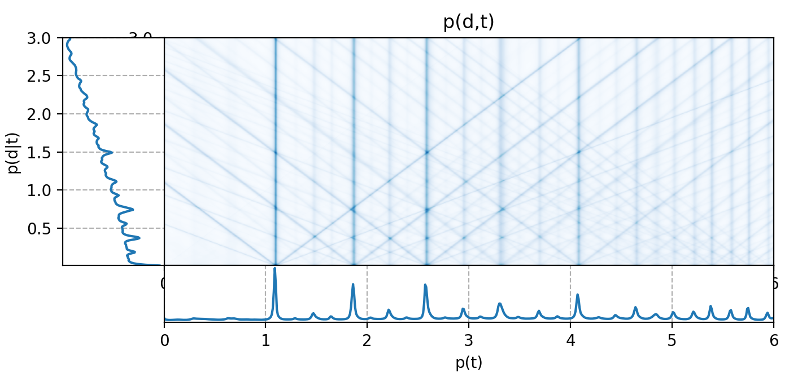

# Cemgil Tempogram



This is a python implementation of Cemgil's tempogram.

> Cemgil A T, Kappen B, Desain P, et al. On tempo tracking: Tempogram representation and Kalman filtering[J]. Journal of New Music Research, 2000, 29(4): 259-273.


**Requirments**:
- torch
- madmom
- librosa
- numpy
- matplotlib

**Simple usage**:
```python
from cegmil.rythm import cegmil_tempogram
Tg = cegmil_tempogram('95bpm.wav',
                        fps=100, 
                        d_range=(1, 300), 
                        a_m=[0.25, 0.5, 1, 0.5, 0.25], 
                        device='cpu')
```
Tg.shape align with [librosa](https://librosa.org/doc/latest/generated/librosa.feature.tempogram.html).

`device` set to `'cuda'` to use Torch version, otherwise Numpy.


